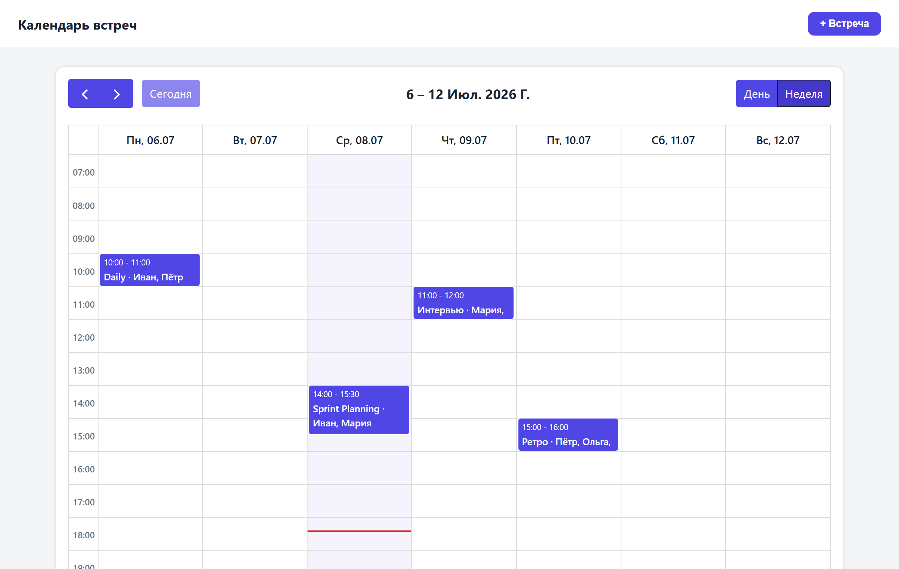

# Календарь встреч компании

**Живая версия:** https://meet-calendar.vercel.app

Простой инструмент: сотрудник добавляет встречу (кто, с кем, когда), любой видит
расписание на день/неделю, слот **нельзя занять**, если кто-то из участников в это
время уже занят.

**Стек:** статический сайт (HTML/CSS/JS) + [FullCalendar](https://fullcalendar.io)
(готовый календарь) + [Supabase](https://supabase.com) (Postgres + готовый REST-API).
Бэкенд не писал — Supabase отдаёт API из коробки. Отображение календаря не рисовал —
взял FullCalendar.

## Что внутри

| Файл | Роль |
|------|------|
| `index.html` | разметка: контейнер календаря + форма |
| `app.js` | вся логика: init FullCalendar, загрузка из Supabase, проверка конфликтов, CRUD |
| `style.css` | оформление |
| `config.js` | ключи Supabase + список сотрудников |
| `schema.sql` | таблица + доступ |

## Проверка конфликтов

Два интервала пересекаются, если `startA < endB && startB < endA`. Перед вставкой
тянем встречи, пересекающиеся по времени, и проверяем общих участников
(`findConflict` в [`app.js`](app.js)). Если пересечение есть — вставки нет, показываем,
кто и чем занят, **и предлагаем ближайший свободный слот той же длительности** в этот
день одной кнопкой (`suggestSlot`) — инструмент не просто блокирует, а помогает.

## Осознанные упрощения 

- **Календарь — готовый FullCalendar, не свой** — переключение день/неделя,
  навигация, сетка времени, «сегодня» уже в нём.
- **Без реальной авторизации** — участники выбираются из списка. Задание про
  логику бронирования, а тул временный.
- **Проверка конфликта read-then-insert** — есть теоретическое окно гонки при двух
  одновременных бронированиях. Для демо ок; в проде решается exclusion-constraint
  в Postgres или транзакцией. Помечено `ponytail:`-комментарием в коде.
  
